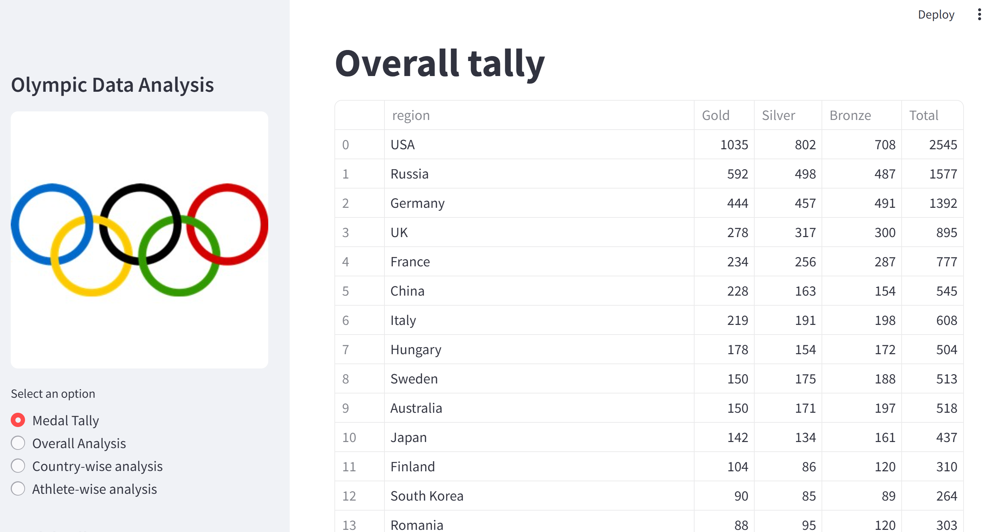
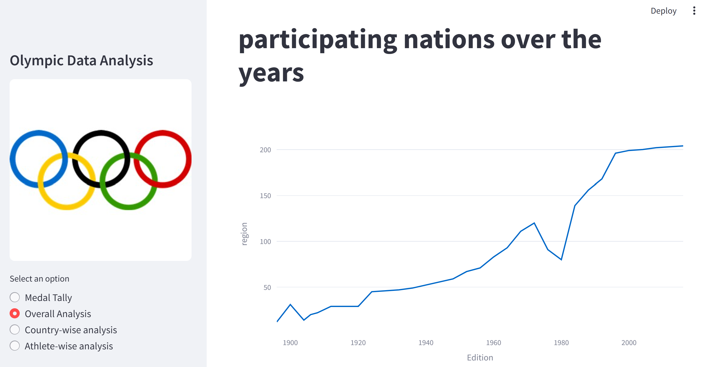
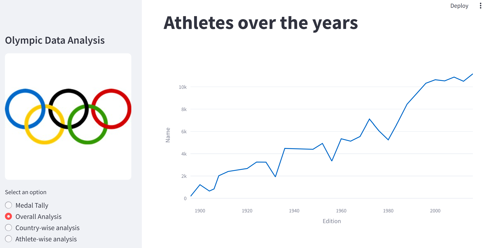
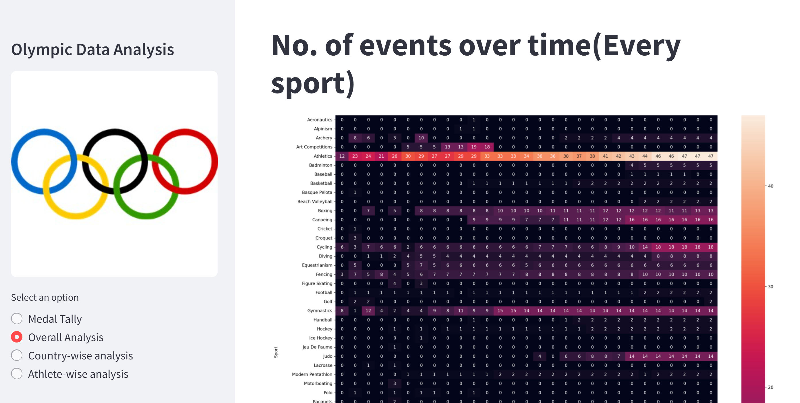
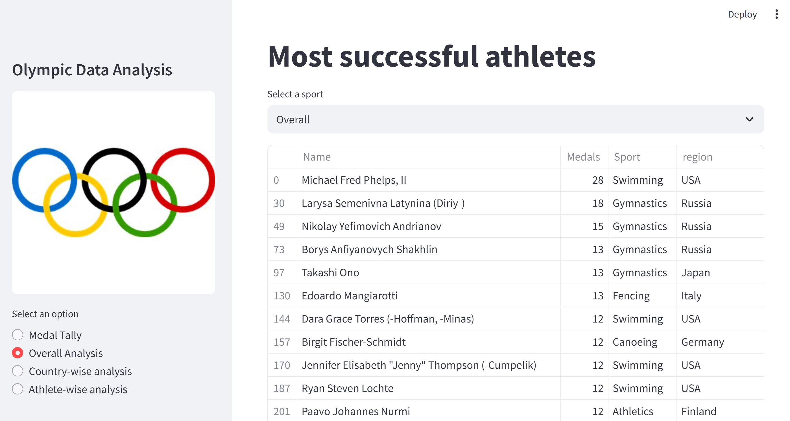
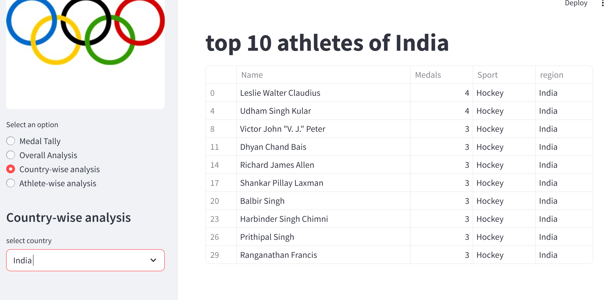
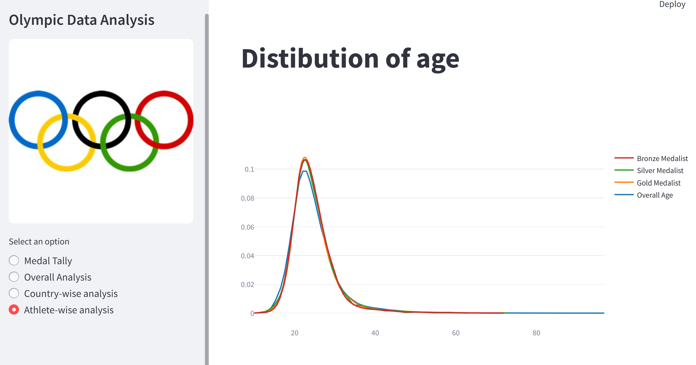
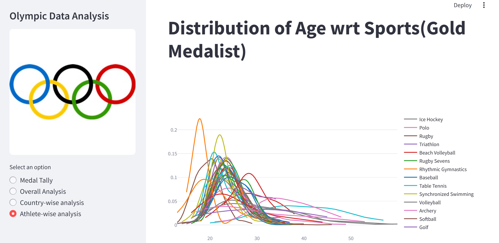
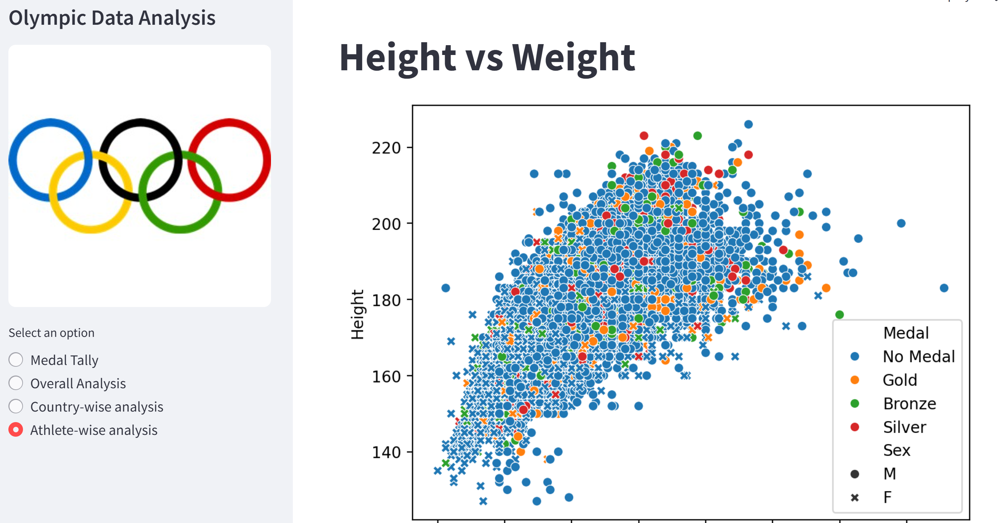

# 🏅 Olympics Data Analysis Web App

This Streamlit app provides an interactive analysis of the historical Olympic Games dataset. Users can explore medal tallies, trends, country-wise performance, and athlete statistics with beautiful visualizations powered by Plotly, Matplotlib, and Seaborn.

---

## 📊 Features

- 🎖️ **Medal Tally Viewer**  
  View medal counts by country and year. Compare performances over time.

- 🌍 **Overall Olympic Analysis**  
  Analyze overall statistics like editions, cities, sports, athletes, and events. Track trends over the years.

- 🇺🇸 **Country-wise Analysis**  
  Dive deep into a specific country’s Olympic journey. See which sports they excelled in and who their top athletes were.

- 🧍‍♂️ **Athlete-wise Analysis**  
  Explore athlete statistics like age distributions, gender participation trends, and sport-specific performance.

---

## 🧾 Dataset Used

- **Athlete Events:** `Athlete_Event.csv`  
  Contains data on every athlete who participated in the Olympics from 1896 to 2016.

- **NOC Regions:** `noc_regions.csv`  
  Maps NOC codes to country/region names.

---

## 🛠️ Technologies Used

- **Frontend & App Framework:** [Streamlit](https://streamlit.io/)
- **Data Analysis:** Pandas, NumPy
- **Data Visualization:** Plotly, Seaborn, Matplotlib
- **Others:** PyArrow, SciPy

---
📁 Project Structure
```
olympics-analysis-app/
│
├── app.py                  # Main Streamlit app
├── helper.py               # Contains all backend helper functions
├── preprocesser.py         # Preprocessing logic for the dataset
├── requirements.txt
├── README.md
├── Athlete_Event.csv       #dataset
├── noc_regions.csv         #dataset
└── olympic_logo.png
```

## 🚀 How to Run

### 1. Clone the repository

```bash
git clone https://github.com/your-username/olympics-analysis-app.git
cd olympics-analysis-app
```

### 2. Install dependencies
Create a virtual environment
```
python -m venv env
env\Scripts\activate
```

### 3. Install required packages:
```
pip install -r requirements.txt
```

### 4. Add the CSV files
Ensure the following files are placed in the project root:
- Athlete_Event.csv
- noc_regions.csv
- olympic_logo.png (for sidebar branding)

### 5. Run the app
```
streamlit run app.py
```

## Screenshots

<p align="center">
  
</p>
<p align="center">
  
</p>
<p align="center">
  
</p>
<p align="center">
  
</p>
<p align="center">
  
</p>
<p align="center">
  
</p>
<p align="center">
  
</p>
<p align="center">
  
</p>
<p align="center">
  
</p>
<p align="center">
  
</p>
<p align="center">
  
</p>

## 🙌 Acknowledgements
### Dataset sourced from Kaggle - Olympic History Dataset

### Streamlit documentation and community for excellent support.

